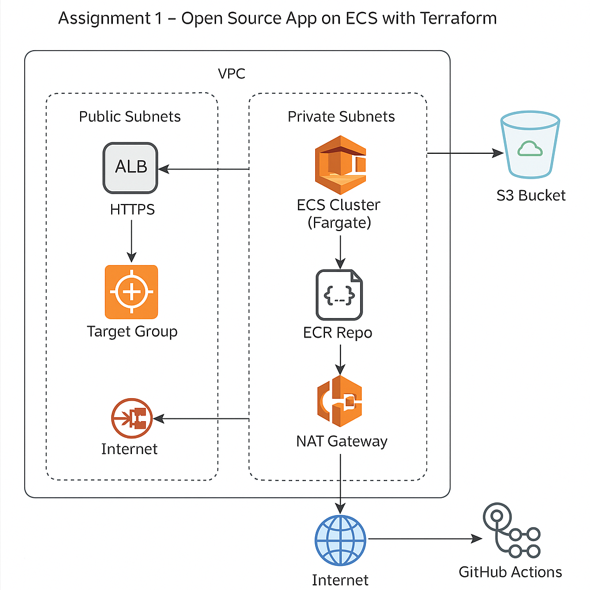

# 🧪 Assignment 1 – Open Source App on ECS with Terraform

This project is based on [**Amazon's Threat Composer Tool**](https://awslabs.github.io/threat-composer/workspaces/default/dashboard), an open-source platform designed to:

- ✍️ Facilitate **visual threat modeling**
- 🔐 Improve **security assessments**
- 🚀 Enable teams to model threats in a collaborative dashboard

---

## 🚀 What's Live Now — Production Infra & CI/CD Highlights

This repo now includes a **fully automated, cloud-native DevOps pipeline**, using modern best practices:

### ✅ Infra & Deployment Features

- **App containerized** and hosted on **Amazon ECR**
- **Deployed on ECS Fargate** (no public IPs; uses NAT gateway via private subnets)
- **Modular Terraform infrastructure** (VPC, ALB, ECS split cleanly)
- **CI/CD via GitHub Actions**:
  - 🔄 Auto-builds Docker image on push to `main`
  - 📤 Pushes to ECR
  - 🛠 Patches ECS task definition
  - 🚢 Updates ECS Service — **no manual `terraform apply` needed**
- **GitHub OIDC IAM Role** — secure, access-key-free deploys
- **S3 Bucket Provisioned**: `khalids-ecs-threat-composer-tool-s3-bucket`
- **AWS Region**: `eu-west-2 (London)`

---

    

---

## 🛠 Infrastructure Overview (Provisioned via Terraform)

- **ECS Cluster** (Fargate launch type)
- **ECR Repository**: `ecs-threat-composer-tool`
- **ECS Task Definition** (patched dynamically via CI)
- **ALB** (Application Load Balancer) with target group and listeners
- **Private Subnets** (for ECS tasks)
- **Public Subnets** (for ALB)
- **NAT Gateway** (to allow ECS tasks internet access)
- **S3 Bucket**: `khalids-ecs-threat-composer-tool-s3-bucket`
- **IAM Roles**:
  - ECS Task Execution Role
  - GitHub OIDC Deployment Role (`github-deploy-role`)

---

## 🤖 CI/CD Pipeline – GitHub Actions

A workflow runs on every push to `main` and performs:

1. 🔧 **Builds the Docker image**
2. 📤 **Pushes image to ECR**  

226754875437.dkr.ecr.eu-west-2.amazonaws.com/ecs-threat-composer-tool:latest

3. 📦 **Fetches current ECS task definition**
4. 🔁 **Patches task definition with new image**
5. 🆕 **Registers updated task definition**
6. 🔄 **Updates ECS Service**

✅ **No Terraform Apply needed after initial setup**

---

## 🔐 Secure Auth: GitHub OIDC Role

- Uses **OpenID Connect (OIDC)** via IAM role: `github-deploy-role`
- No long-term AWS access keys
- Role is restricted to:
- `repo: khalidhersi/ecs-threat-composer-tool`
- `branch: main`

---

## 🧠 Terraform Best Practices Followed

- 🔹 **Modular structure**:

/modules/vpc
/modules/alb
/modules/ecs

- 🔹 Uses **outputs** to link modules
- 🔹 **Private subnets + NAT** = secure outbound access for ECS
- 🔹 **Public ALB** routes to ECS via Target Group
- 🔹 **ECR repo** managed by Terraform
- 🔹 IAM roles are **least-privilege and explicitly defined**

---

## 🔗 Useful Resources

- [Terraform AWS Provider](https://registry.terraform.io/providers/hashicorp/aws/latest/docs)
- [Terraform ECS Cluster](https://registry.terraform.io/providers/hashicorp/aws/latest/docs/resources/ecs_cluster)
- [Terraform Docs](https://www.terraform.io/docs/index.html)
- [Amazon ECS User Guide](https://docs.aws.amazon.com/ecs/latest/userguide/what-is-ecs.html)
